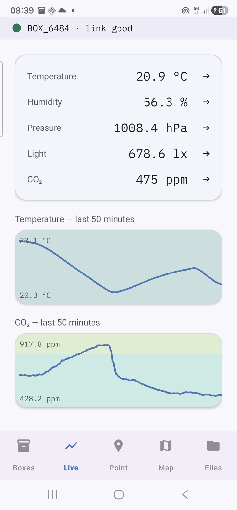
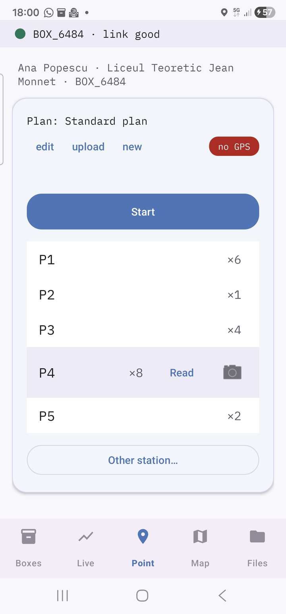
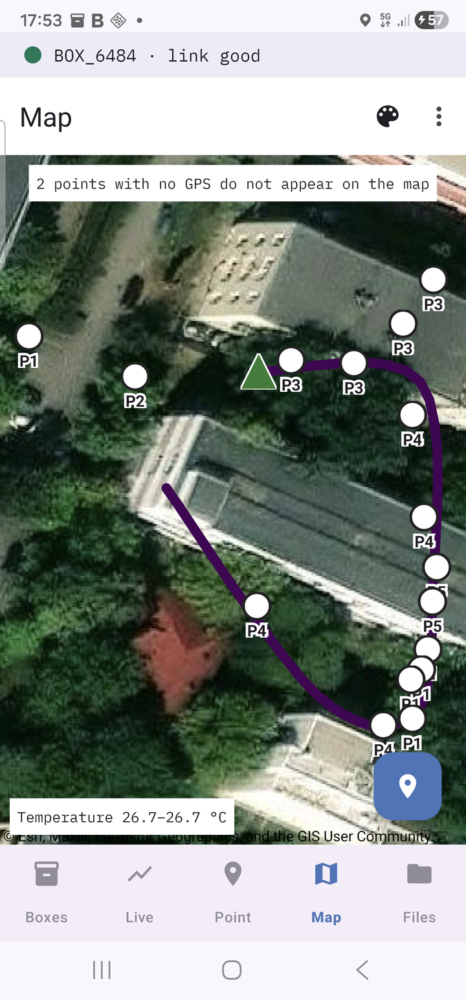
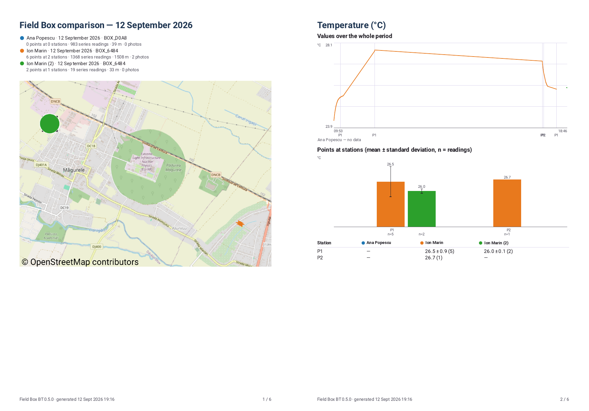

# Field Box BT

**English** · [Română](README_RO.md)

**Version 0.8.0** · Android 10 or newer · box firmware 0.3.1-bt · manuals in English and Romanian

## For teachers

Field Box is a kit for environmental measurements on school trips and route
walks. A small sensor box rides in a backpack and measures air temperature,
humidity, pressure, CO₂ and light every 5 seconds. The **Field Box BT** app on
an Android phone talks to it over Bluetooth: it shows the values live, records
the route on a map, reads the box at each station with a photo, and writes
a PDF report of the day that the class can compare between groups.

**The app and the box each have a manual, in English and in Romanian:** a user
manual (every screen, the field day step by step, troubleshooting, a one-page
field card) and an installation guide.

### ⬇️ [Download Field Box 0.8.0 (a single ZIP file)](https://github.com/GeoEduLab/FieldBox/releases/download/v0.8.0/FieldBox_v0.8.0.zip)

The archive holds the app, the box firmware and the four manuals, all from
the same version.

The manuals alone (PDF and Word, English and Romanian, in the same folders as
in the archive): **[FieldBox_docs_v0.8.0.zip](https://github.com/GeoEduLab/FieldBox/releases/download/v0.8.0/FieldBox_docs_v0.8.0.zip)**. Every PDF below also
opens here on GitHub; the ⬇ arrow next to it downloads it.

---

## What it looks like

| Live | Point | Map |
|:---:|:---:|:---:|
|  |  |  |
| the values right now and the last 50 minutes | the stations of the route; one tap reads the box, with a photo | the route walked and the points read |

<em>The PDF reports. Left: the comparison report, every group of the class on one map. Right: the box day, CO₂ over the whole day on coloured air-quality bands, with the highest and lowest values.</em>

---

## 1. Installing the app on the phone

The app is not on the Play Store; it is installed from the APK file in the
`app` folder.

1. Copy `fieldbox-bt-0.8.0.apk` onto the phone (WhatsApp, a USB cable or
   Google Drive) and tap it.
2. If Android asks, allow installs **from this source**, then tap
   **Install**.
3. If Google Play Protect suggests a scan, tap **Scan app** (or, offline,
   **More details → Install without scanning**). The app is simply not from
   the Play Store; that is all the warning means.
4. On first launch allow the camera, **precise** location and notifications.

A newer version installs **over** the old one; the files on the phone stay.
The app itself is in English. The same steps with a picture of every screen
are in the [installation guide](manuale/Install_EN.pdf) [⬇](https://github.com/GeoEduLab/FieldBox/raw/main/manuale/Install_EN.pdf).

Pairing the box over Bluetooth and the first connection are in the same guide
(chapter 3, with a picture of every step).

## 2. The box firmware

Boxes as delivered need nothing. To update one, open
`firmware/fieldbox_bt_v0_3/fieldbox_bt_v0_3.ino` in the **Arduino IDE** and
upload it over USB. Chapter 5 of the [installation guide](manuale/Install_EN.pdf) [⬇](https://github.com/GeoEduLab/FieldBox/raw/main/manuale/Install_EN.pdf) walks
through every click, with screenshots. Using esptool or the Flash Download Tool instead,
write `firmware/fieldbox-fw-0.3.1-bt.bin` at address `0x0`. **Download the files from
the box first:** the first start after an update clears its memory.

## 3. The manuals

All of them in one archive: **[FieldBox_docs_v0.8.0.zip](https://github.com/GeoEduLab/FieldBox/releases/download/v0.8.0/FieldBox_docs_v0.8.0.zip)**. A single
PDF: click its name to read it on GitHub, or ⬇ to download it.

| | English | Română |
|---|---|---|
| User manual | [User_manual_EN.pdf](manuale/User_manual_EN.pdf) [⬇](https://github.com/GeoEduLab/FieldBox/raw/main/manuale/User_manual_EN.pdf) | [Manual_utilizare_RO.pdf](manuale/Manual_utilizare_RO.pdf) [⬇](https://github.com/GeoEduLab/FieldBox/raw/main/manuale/Manual_utilizare_RO.pdf) |
| Installation guide | [Install_EN.pdf](manuale/Install_EN.pdf) [⬇](https://github.com/GeoEduLab/FieldBox/raw/main/manuale/Install_EN.pdf) | [Instalare_RO.pdf](manuale/Instalare_RO.pdf) [⬇](https://github.com/GeoEduLab/FieldBox/raw/main/manuale/Instalare_RO.pdf) |

The same manuals as editable Word files are in the [manuale](manuale) folder.
What changed between versions: [CHANGELOG.pdf](CHANGELOG.pdf) [⬇](https://github.com/GeoEduLab/FieldBox/raw/main/CHANGELOG.pdf).
