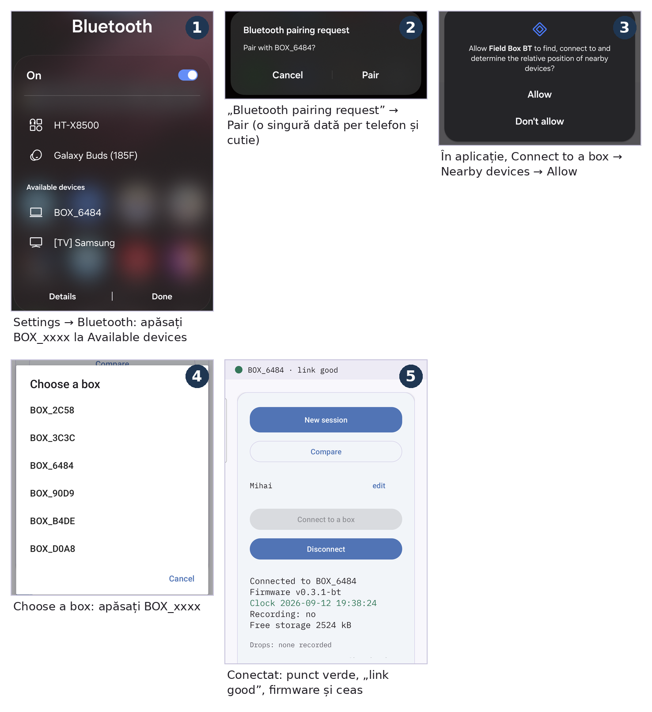

# Field Box BT

[English](README.md) · **Română**

**Versiunea 0.8.0** · Android 10 sau mai nou · firmware-ul cutiei 0.3.1-bt · manuale în română și în engleză

## Pentru profesori

Field Box este un set pentru măsurători de mediu în excursii și pe trasee
cu elevii. O cutiuță cu senzori, purtată în rucsac, măsoară la fiecare
5 secunde temperatura și umiditatea aerului, presiunea, CO₂ și lumina.
Aplicația **Field Box BT** de pe un telefon Android vorbește cu ea prin
Bluetooth: arată valorile în timp real, înregistrează traseul pe hartă,
citește cutia la fiecare stație, cu fotografie, și face un raport PDF al zilei,
pe care clasa îl poate compara între grupe.

**Aplicația și cutia au manuale în română și în engleză:** un manual de
utilizare (fiecare ecran, ziua de teren pas cu pas, ce faceți când ceva nu
merge, o fișă de teren pe o pagină) și un ghid de instalare.

### ⬇️ [Descărcați Field Box 0.8.0 (un singur fișier ZIP)](https://github.com/GeoEduLab/FieldBox/releases/download/v0.8.0/FieldBox_v0.8.0.zip)

Arhiva conține aplicația, firmware-ul cutiei și cele patru manuale, toate din
aceeași versiune.

Doar manualele (PDF și Word, în română și în engleză, în aceleași foldere ca
în arhivă): **[FieldBox_docs_v0.8.0.zip](https://github.com/GeoEduLab/FieldBox/releases/download/v0.8.0/FieldBox_docs_v0.8.0.zip)**. Fiecare PDF de mai jos se
deschide și aici, pe GitHub; săgeata ⬇ de lângă el îl descarcă.

---

## 1. Instalarea aplicației pe telefon

Aplicația nu este în Play Store; se instalează din fișierul APK din folderul
`app`.

1. Aduceți `fieldbox-bt-0.8.0.apk` pe telefon (WhatsApp, cablu USB sau
   Google Drive) și apăsați pe el.
2. Dacă Android cere, permiteți instalarea **din această sursă** („Allow from
   this source”), apoi apăsați **Install**.
3. Dacă Google Play Protect propune o scanare, apăsați **Scan app** (sau, fără
   internet, **More details → Install without scanning**). Avertismentul
   apare doar pentru că aplicația nu e din Play Store.
4. La prima pornire permiteți camera, locația **precisă** și notificările.

O versiune nouă se instalează **peste** cea veche; fișierele de pe telefon
rămân. Aplicația este în engleză. Aceiași pași, cu poza fiecărui ecran, sunt
în [ghidul de instalare](manuale/Instalare_RO.pdf) [⬇](https://github.com/GeoEduLab/FieldBox/raw/main/manuale/Instalare_RO.pdf).

**Conectarea cutiei:** o asociați o dată, per telefon și cutie, apoi vă
conectați din aplicație.

1. Porniți cutia (LED-ul clipește). Pe telefon deschideți **Setări →
   Bluetooth**; la **Available devices** cutia apare ca **BOX_xxxx** (codul de
   pe eticheta ei). Apăsați pe ea.
2. La **„Bluetooth pairing request”** apăsați **Pair**. Nu cere PIN;
   asocierea rămâne salvată.
3. În aplicație apăsați **Boxes → Connect to a box**. Prima dată Android cere
   permisiunea **Nearby devices**: apăsați **Allow**.
4. În fereastra **Choose a box** apăsați **BOX_xxxx**.
5. În câteva secunde fâșia de sus devine verde, **BOX_xxxx · link good**, iar
   cardul arată firmware-ul și ceasul cutiei (se potrivește singur).

## 2. Firmware-ul cutiei (pentru tehnician)

Cutiile livrate nu au nevoie de nimic. Pentru o actualizare, deschideți
`firmware/fieldbox_bt_v0_3/fieldbox_bt_v0_3.ino` în **Arduino IDE** și
scrieți-l pe cutie prin USB. Capitolul 5 din [ghidul de instalare](manuale/Instalare_RO.pdf) [⬇](https://github.com/GeoEduLab/FieldBox/raw/main/manuale/Instalare_RO.pdf)
arată fiecare clic, cu capturi de ecran. Cu esptool sau Flash Download Tool,
scrieți `firmware/fieldbox-fw-0.3.1-bt.bin` la adresa `0x0`. **Luați mai întâi
fișierele de pe cutie:** prima pornire după actualizare îi golește memoria.

## 3. Manualele

Toate într-o singură arhivă: **[FieldBox_docs_v0.8.0.zip](https://github.com/GeoEduLab/FieldBox/releases/download/v0.8.0/FieldBox_docs_v0.8.0.zip)**. Un singur
PDF: apăsați pe nume ca să-l citiți pe GitHub, sau pe ⬇ ca să-l descărcați.

| | Română | English |
|---|---|---|
| Manualul de utilizare | [Manual_utilizare_RO.pdf](manuale/Manual_utilizare_RO.pdf) [⬇](https://github.com/GeoEduLab/FieldBox/raw/main/manuale/Manual_utilizare_RO.pdf) | [User_manual_EN.pdf](manuale/User_manual_EN.pdf) [⬇](https://github.com/GeoEduLab/FieldBox/raw/main/manuale/User_manual_EN.pdf) |
| Ghidul de instalare | [Instalare_RO.pdf](manuale/Instalare_RO.pdf) [⬇](https://github.com/GeoEduLab/FieldBox/raw/main/manuale/Instalare_RO.pdf) | [Install_EN.pdf](manuale/Install_EN.pdf) [⬇](https://github.com/GeoEduLab/FieldBox/raw/main/manuale/Install_EN.pdf) |

Aceleași manuale, ca fișiere Word editabile, sunt în folderul
[manuale](manuale). Ce s-a schimbat de la o versiune la alta:
[CHANGELOG.pdf](CHANGELOG.pdf) [⬇](https://github.com/GeoEduLab/FieldBox/raw/main/CHANGELOG.pdf).
